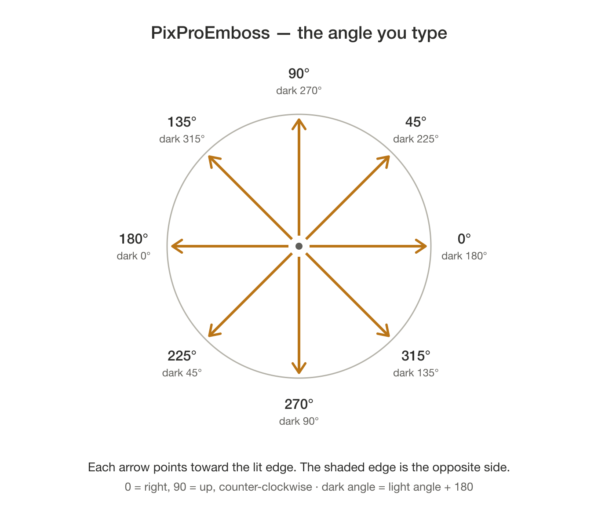

# PixProEmboss 2.7.7

Embosses the selected Pixelmator Pro layer — text, a shape, or a group of
shaped text — so it reads as raised off the canvas, with a lit edge on one
side and a shaded edge on the other.

### [⬇︎ Download the latest release](https://github.com/spurious-cox/pixproemboss/releases/latest)

Notarized and stapled by Apple — open the DMG and drag PixProEmboss to Applications,
or install it with Homebrew:

```
brew install --cask spurious-cox/tap/pixproemboss
```
Requires Pixelmator Pro. Both the 3.x build and the Creator Studio build work;
the app binds to whichever one is in front or has a document open.

## Using it

1. In Pixelmator Pro, select the layer to emboss. It has to be at the **top
   level** of the Layers list; select several and each is embossed in turn.
2. Run PixProEmboss.
3. Answer the one prompt — `angle / depth / blur`, for example `135 / 10 / 5`:

   | Field | Means |
   |---|---|
   | Angle | 0–359, the direction the light comes from |
   | Depth | shadow offset distance; larger = more raised |
   | Blur | softness of the shadow edge; larger = softer |

   

   The values are saved and offered again next run.

## What you get

One group per layer, named after the source layer, holding a light copy, a dark
copy, and your original — locked, hidden, and untouched at the bottom. Delete
the group and unhide the original to start over.

## How it works

The layer is duplicated twice and each copy filled black, then given a drop
shadow: the light copy's at the light angle in white, the dark copy's at the
opposite angle. The copies are converted to pixels and blended over the
original — light on **screen**, dark on **multiply** — so only the two shadows
show. Lit edge one side, shaded edge the other, which is the whole illusion.

Top-level layers only, by design. In-group recursion was prototyped and
deliberately dropped as not worth the complexity.

## Building

```
# no build script: compile the applet and re-sign
osacompile -o /tmp/PixProEmboss.scpt PixProEmboss.applescript
```

The Read Me button opens `PixProEmboss-README.rtfd` from the app's Resources: the
text Read Me with `PixProEmboss-angles.png` in place of the line that names it.

The app is signed with a timestamped Developer ID certificate, which keeps
macOS's Automation grant alive across rebuilds, then notarized and stapled.

## Problems or suggestions

Open an issue: https://github.com/spurious-cox/pixproemboss/issues

## License

MIT. See [LICENSE](LICENSE).
